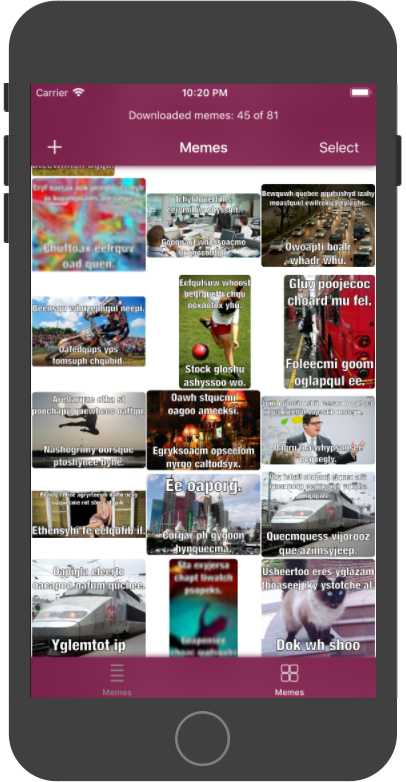
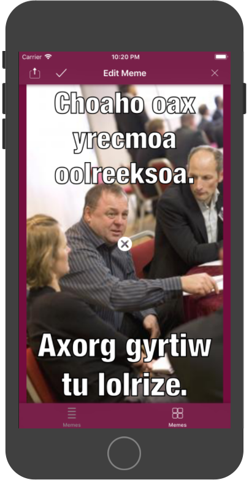

# Portfolio Sample iOS App: MemeMe

- For making & sharing memes.
- Current version will create random memes for demo.
	- It downloads the random images concurrently.
	- It also displays the download counter in the nav bar as displayed in the first image below.

## Requirements

- Built with Swift 3.3 and Xcode 9.3.1.
- CocoaPods
- Not required but design assets managed by PaintCode.

## Output

